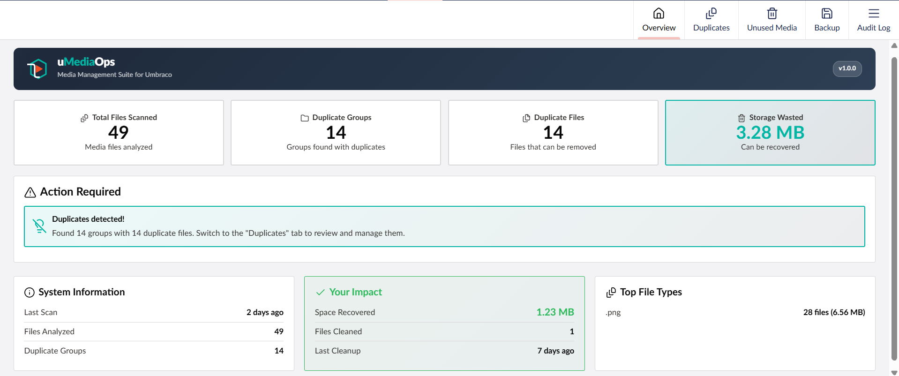
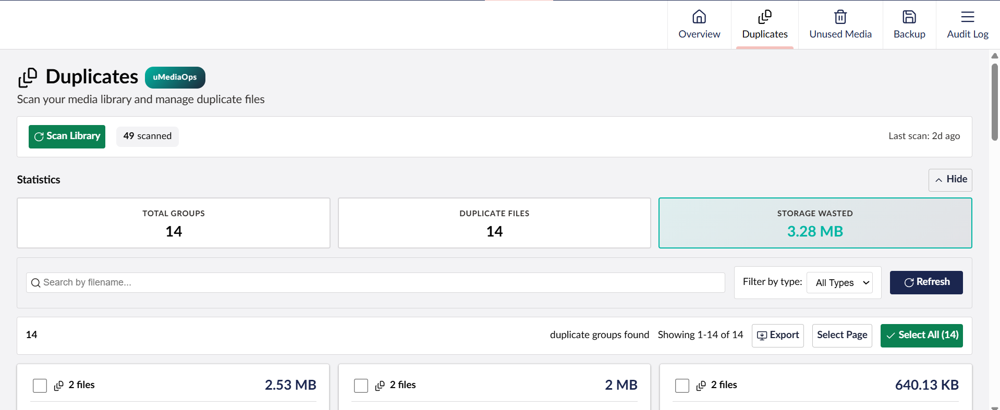
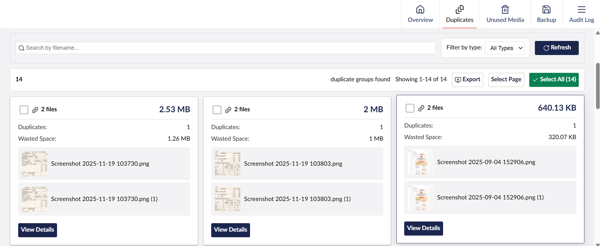
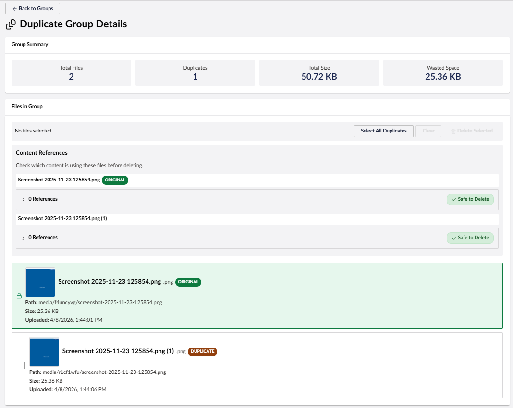
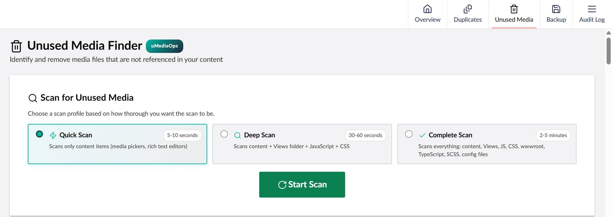
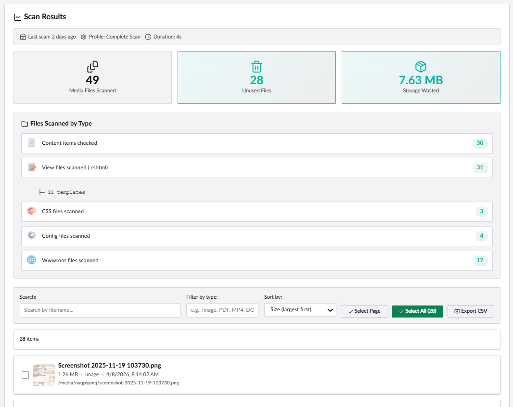
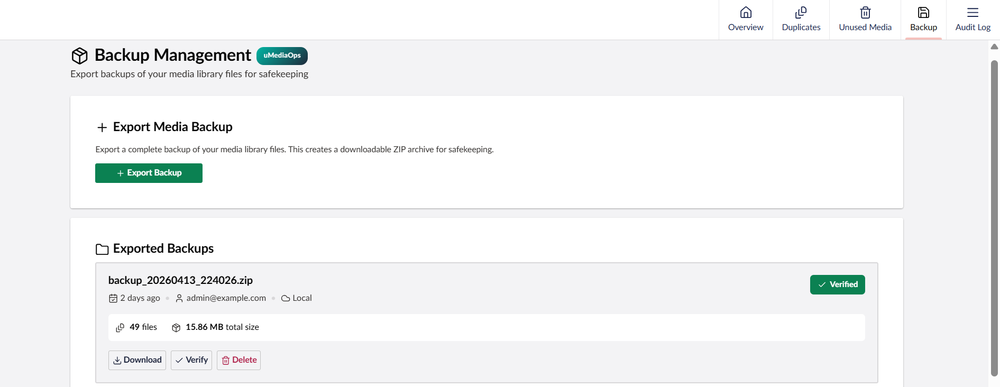
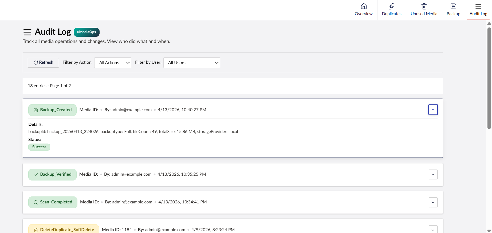

<p align="center">
  
</p>

<h1 align="center">uMediaOps</h1>
<p align="center">Media Management Suite for Umbraco</p>

<p align="center">
  <a href="https://www.nuget.org/packages/uMediaOps"></a>
  <a href="https://www.nuget.org/packages/uMediaOps"></a>
  <a href="https://marketplace.umbraco.com/package/umediaops"></a>
  <a href="LICENSE"></a>
  <a href="https://umbraco.com"></a>
  <a href="https://dotnet.microsoft.com"></a>
</p>

Comprehensive media management package for Umbraco 17+ that helps you find duplicates, clean up unused media, create backups, and track all operations with audit logging.

## Features

| Feature             | Description                                                                                         |
| ------------------- | --------------------------------------------------------------------------------------------------- |
| Duplicate Detection | SHA256-based file hashing with bulk delete operations and reference checking                        |
| Unused Media Finder | Scans content, templates, views, JS, CSS, SCSS, TypeScript, and config files for unreferenced media |
| Backup Management   | Export media library as ZIP with integrity verification                                             |
| Audit Log           | Full history of all media operations with user attribution                                          |
| Analytics Dashboard | Duplicate trends over time, storage savings tracking, and file type statistics                      |

## Screenshots










## Installation

```bash
dotnet add package uMediaOps
```

The package automatically:

- Registers all services via Umbraco's Composer pattern
- Runs database migrations on first startup
- Adds the "uMediaOps" section to the Umbraco backoffice

## Getting Started

After installing the package and restarting your Umbraco site:

1. Log in to the Umbraco backoffice
2. Go to **Users** section → select your user group (e.g., "Administrators")
3. Under **Permissions → Sections**, enable the **uMediaOps** section and save
4. Refresh the page — the **uMediaOps** icon will appear in the left sidebar
5. Click it to access the Overview dashboard with all features

## Configuration

Add to your `appsettings.json` (optional — defaults are provided):

```json
{
  "uMediaOps": {
    "BackupDirectory": "~/App_Data/uMediaOps/Backups",
    "BackupRetentionDays": 30
  }
}
```

| Setting               | Default                        | Description                                                                 |
| --------------------- | ------------------------------ | --------------------------------------------------------------------------- |
| `BackupDirectory`     | `~/App_Data/uMediaOps/Backups` | Directory for backup ZIP files. `~/` resolves to content root.              |
| `BackupRetentionDays` | `30`                           | Days to retain backups before cleanup eligibility. `0` = keep indefinitely. |

## Requirements

- Umbraco 17.0+
- .NET 10.0+
- SQLite or SQL Server

## Database Tables

uMediaOps creates the following tables automatically via migrations:

- `uMediaOps_FileHashes` — SHA256 hashes for duplicate detection
- `uMediaOps_References` — Media reference tracking
- `uMediaOps_AuditLog` — Operation audit trail
- `uMediaOps_Analytics` — Scan statistics and trends
- `uMediaOps_Backups` — Backup metadata
- `uMediaOps_UnusedMediaScans` — Unused media scan metadata
- `uMediaOps_UnusedMediaItems` — Individual unused media items

## API Endpoints

All endpoints require backoffice authentication and are available under:
`/umbraco/management/api/v1/umediaops/`

| Route Prefix           | Description                        |
| ---------------------- | ---------------------------------- |
| `umediaops/scan`       | Duplicate scan operations          |
| `umediaops/duplicates` | Duplicate group management         |
| `umediaops/unused`     | Unused media scanning              |
| `umediaops/backup`     | Backup create/list/download/delete |
| `umediaops/auditlog`   | Audit log queries                  |
| `umediaops/analytics`  | Statistics and trends              |
| `umediaops/references` | Media reference lookups            |

## Known Limitations

- Background operations (scans, backups) run in-process. If the app pool recycles mid-operation, work in progress will be lost.
- Progress tracking uses in-process memory cache, designed for single-instance deployments.

## Documentation

- [Contributing](CONTRIBUTING.md)

## License

MIT License — see [LICENSE](LICENSE) for details.
